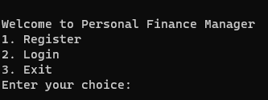

# Personal Finance Manager

This is a simple personal finance manager application built with Node.js, Express, and SQLite and CLI interface using Python.

## Features

- User registration and login
- Add, view, update, and delete financial transactions
- Add, view, and manage custom categories
- Set and track savings goals
- Generate reports on income, expenses, and savings

## Setup

1. Clone the repository:
    ```sh
    https://github.com/Sar-thak-3/Financial-Manager.git
    ```
2. Install dependencies:
    ```sh
    cd Financial-Manager
    npm install
    ```
3. Run the server:
    ```sh
    node app.js
    ```

## API Endpoints

### Auth

- `POST /auth/register`: Register a new user
- `POST /auth/login`: Login a user

### Transactions

- `POST /transactions/:user_id`: Add a new transaction
- `GET /transactions/:user_id`: View all transactions for a user
- `PUT /transactions/:transaction_id`: Update a transaction
- `DELETE /transactions/:transaction_id`: Delete a transaction

### Categories

- `POST /categories`: Add a new category
- `GET /categories/:user_id`: View all categories for a user
- `PUT /categories/:category_id`: Update a category
- `DELETE /categories/:category_id`: Delete a category

### Savings Goals

- `POST /savings-goals/:user_id`: Add a new savings goal
- `GET /savings-goals/:user_id`: View all savings goals for a user
- `PUT /savings-goals/:goal_id`: Update a savings goal
- `DELETE /savings-goals/:goal_id`: Delete a savings goal

## CLI Interface
```
$ pip install requests
$ python main.py  # To run the main python file which contains the CLI interface!
```

## Interface screenshots

- *Choose the numbers according to the api you want to access*.
- *Before adding any transaction you need to add atleast one category as specified in assignment*

## Testing

To be implemented...
